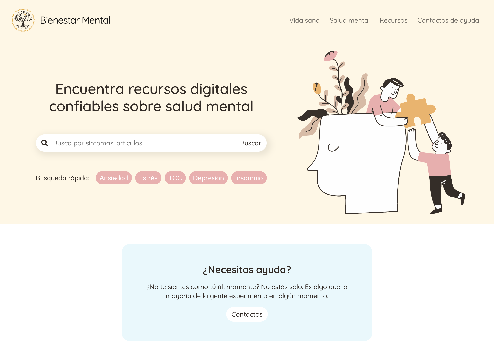

# Bienestar Mental

Proyecto final para el curso Desarrollo Web - CoderHouse

**Sitio para quienes buscan recursos digitales confiables e información de calidad sobre salud mental.**

### https://bienestar-mental.vercel.app/

### Tecnologías utilizadas
- HTML 5
- CSS 3
- SASS
- Bootstrap 5.1

